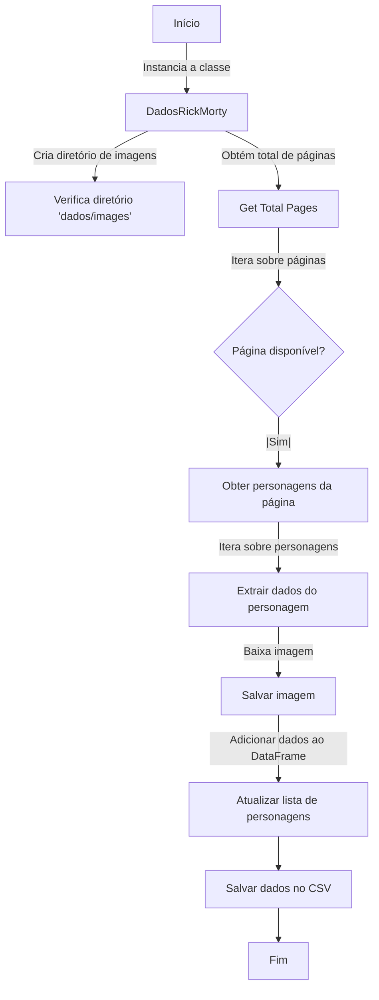

```mermaid
graph TD;
    A[Início] -->|Instancia a classe| B[DadosRickMorty]
    B -->|Cria diretório de imagens| C[Verifica diretório 'dados/images']
    B -->|Obtém total de páginas| D[Get Total Pages]
    D -->|Itera sobre páginas| E{Página disponível?}
    E --|Sim|--> F[Obter personagens da página]
    F -->|Itera sobre personagens| G[Extrair dados do personagem]
    G -->|Baixa imagem| H[Salvar imagem]
    H -->|Adicionar dados ao DataFrame| I[Atualizar lista de personagens]
    I --> J[Salvar dados no CSV]
    J --> K[Fim]
```

